# PixelForge Nexus Authentication State Machine

A formal state machine model of the PixelForge Nexus authentication flow, covering login, multi-factor authentication (MFA/TOTP), session management, middleware enforcement, and account settings operations.

This diagram is derived directly from the codebase:
- `src/actions/auth.ts` — `signIn`, `signOut`, `verifyMfa` server actions
- `src/lib/supabase/middleware.ts` — `updateSession` middleware (runs on every request)
- `src/app/(dashboard)/dashboard/settings/page.tsx` — MFA enrollment/unenrollment, password change
- `src/lib/validations.ts` — `loginSchema`, `mfaVerifySchema`, `changePasswordSchema`

## State Machine Diagram

```mermaid
stateDiagram-v2
    %% ============================================================
    %% States
    %% ============================================================
    [*] --> Unauthenticated

    state "Unauthenticated" as Unauth {
        [*] --> LoginPage
        LoginPage: /login page\nUser enters email + password
    }

    state "Authenticated (AAL1 — No MFA)" as AAL1_NoMFA {
        [*] --> Dashboard_NoMFA
        Dashboard_NoMFA: /dashboard\nnextLevel=aal1\nNo TOTP factor enrolled
    }

    state "AAL1 — MFA Required" as AAL1_MFA_Required {
        [*] --> MFAVerifyPage
        MFAVerifyPage: /mfa-verify page\nnextLevel=aal2, currentLevel!=aal2\nUser has TOTP enrolled but session is AAL1
    }

    state "Authenticated (AAL2 — MFA Verified)" as AAL2 {
        [*] --> Dashboard_AAL2
        Dashboard_AAL2: /dashboard\ncurrentLevel=aal2\nFull access to protected routes
    }

    state "MFA Enrollment Flow" as MFA_Enroll {
        [*] --> EnrollStart
        EnrollStart: Settings page\nmfa.enroll({ factorType: totp })
        EnrollStart --> QRCodeDisplayed : enroll success\nQR code + secret returned
        QRCodeDisplayed: Scan QR code with\nauthenticator app
        QRCodeDisplayed --> VerifyEnrollment : User enters 6-digit code
        VerifyEnrollment: mfa.challenge() then mfa.verify()\nwith factorId + code
    }

    state "Session Refresh (Middleware)" as Middleware {
        [*] --> CheckUser
        CheckUser: supabase.auth.getUser()\nValidates JWT on every request
        CheckUser --> CheckAAL : user exists
        CheckUser --> RedirectLogin : no user & not public route
        CheckAAL: mfa.getAuthenticatorAssuranceLevel()
        CheckAAL --> EnforceMFA : nextLevel=aal2 & currentLevel!=aal2\n& not on /mfa-verify
        CheckAAL --> AllowThrough : nextLevel=aal1 OR currentLevel=aal2
        CheckAAL --> RedirectDashboard : on /mfa-verify but\nnextLevel=aal1 OR currentLevel=aal2
    }

    state "Error States" as Errors {
        InvalidCredentials: Invalid email or password\n(loginSchema validation or\nSupabase auth error)
        InvalidMFACode: Invalid verification code\n(6-digit TOTP mismatch)
        MFAChallengeFailure: Failed to create MFA challenge\n(no TOTP factor found or\nchallenge creation error)
        SessionExpired: JWT expired or invalid\ngetUser() returns null
        EnrollError: MFA enrollment failed\n(Supabase enroll error)
        PasswordChangeError: Password validation failed\n(min 8 chars, uppercase, lowercase,\nnumber, special char, must match)
    }

    %% ============================================================
    %% Transitions — Login Flow
    %% ============================================================
    LoginPage --> AAL1_MFA_Required : signIn() success\n[aalData.nextLevel = aal2\n& currentLevel != aal2]\nredirect(/mfa-verify)

    LoginPage --> Dashboard_NoMFA : signIn() success\n[aalData.nextLevel = aal1]\nredirect(/dashboard)

    LoginPage --> InvalidCredentials : signIn() error\n[Supabase auth.signInWithPassword\nreturns error]

    InvalidCredentials --> LoginPage : User retries login\n(stays on /login)

    %% ============================================================
    %% Transitions — MFA Verification Flow
    %% ============================================================
    MFAVerifyPage --> Dashboard_AAL2 : verifyMfa() success\n[mfa.challenge() + mfa.verify()\nsucceed → AAL2]\nredirect(/dashboard)

    MFAVerifyPage --> InvalidMFACode : verifyMfa() error\n[verify returns error]

    InvalidMFACode --> MFAVerifyPage : User retries code entry\n(stays on /mfa-verify)

    MFAVerifyPage --> MFAChallengeFailure : verifyMfa() error\n[no TOTP factor found\nor challenge creation failed]

    MFAChallengeFailure --> MFAVerifyPage : User retries\n(stays on /mfa-verify)

    %% ============================================================
    %% Transitions — MFA Enrollment (Settings Page)
    %% ============================================================
    Dashboard_NoMFA --> EnrollStart : User clicks "Enable MFA"\non /dashboard/settings

    VerifyEnrollment --> Dashboard_AAL2 : mfa.verify() success\n[TOTP factor now verified]\nAAL1 → AAL2

    VerifyEnrollment --> QRCodeDisplayed : mfa.verify() error\n[Invalid code → toast error]\nUser retries

    EnrollStart --> Dashboard_NoMFA : enroll error\n[Supabase mfa.enroll fails]

    QRCodeDisplayed --> Dashboard_NoMFA : User clicks "Cancel"\n[mfa.unenroll pending factor]\nBack to settings

    %% ============================================================
    %% Transitions — MFA Disable (Settings Page)
    %% ============================================================
    Dashboard_AAL2 --> Dashboard_NoMFA : handleDisableMfa()\n[mfa.unenroll({ factorId })\nsucceeds → refreshSession()]\nAAL2 → AAL1

    Dashboard_AAL2 --> Dashboard_AAL2 : Disable MFA failed\n[unenroll error → toast]\nStays AAL2

    %% ============================================================
    %% Transitions — Password Change (Settings Page)
    %% ============================================================
    Dashboard_NoMFA --> Dashboard_NoMFA : changePassword() success\n[stays authenticated at AAL1]

    Dashboard_NoMFA --> PasswordChangeError : changePassword() error\n[validation or Supabase error]

    PasswordChangeError --> Dashboard_NoMFA : User corrects input\n(stays on /dashboard/settings)

    Dashboard_AAL2 --> Dashboard_AAL2 : changePassword() success\n[stays authenticated at AAL2]

    Dashboard_AAL2 --> PasswordChangeError : changePassword() error

    PasswordChangeError --> Dashboard_AAL2 : User corrects input\n(stays on /dashboard/settings)

    %% ============================================================
    %% Transitions — Middleware Enforcement (every request)
    %% ============================================================
    EnforceMFA --> AAL1_MFA_Required : Middleware redirect\n→ /mfa-verify

    RedirectLogin --> Unauth : Middleware redirect\n→ /login

    RedirectDashboard --> AAL1_NoMFA : Middleware redirect\n→ /dashboard\n[no MFA needed]

    RedirectDashboard --> AAL2 : Middleware redirect\n→ /dashboard\n[already AAL2]

    AllowThrough --> AAL1_NoMFA : Continue request\n[nextLevel = aal1]

    AllowThrough --> AAL2 : Continue request\n[currentLevel = aal2]

    %% ============================================================
    %% Transitions — Session Expiry
    %% ============================================================
    Dashboard_NoMFA --> SessionExpired : getUser() returns null\n[JWT expired/invalid]

    Dashboard_AAL2 --> SessionExpired : getUser() returns null\n[JWT expired/invalid]

    SessionExpired --> Unauth : Middleware redirects to /login

    %% ============================================================
    %% Transitions — Sign Out
    %% ============================================================
    Dashboard_NoMFA --> Unauth : signOut()\n[supabase.auth.signOut()]\nredirect(/login)

    Dashboard_AAL2 --> Unauth : signOut()\n[supabase.auth.signOut()]\nredirect(/login)

    MFAVerifyPage --> Unauth : signOut()\n[supabase.auth.signOut()]\nredirect(/login)

    %% ============================================================
    %% Transitions — Authenticated user visits /login
    %% ============================================================
    AAL1_NoMFA --> AAL1_NoMFA : Visit /login\n[middleware redirects\nauthenticated user → /dashboard]

    AAL2 --> AAL2 : Visit /login\n[middleware redirects\nauthenticated user → /dashboard]
```

## State Descriptions

| State | Route | AAL Level | Description |
|-------|-------|-----------|-------------|
| **Unauthenticated** | `/login` | None | No valid session. User must provide credentials. |
| **AAL1 — No MFA** | `/dashboard` | `aal1` | Authenticated without TOTP enrolled. `nextLevel=aal1`. |
| **AAL1 — MFA Required** | `/mfa-verify` | `aal1` | Authenticated but TOTP is enrolled. `nextLevel=aal2`, `currentLevel!=aal2`. Must verify TOTP to proceed. |
| **AAL2 — MFA Verified** | `/dashboard` | `aal2` | Fully authenticated with TOTP verified. `currentLevel=aal2`. |
| **MFA Enrollment Flow** | `/dashboard/settings` | `aal1` → `aal2` | User enrolling a new TOTP factor from the settings page. |
| **Session Expired** | — | None | JWT expired or invalidated. Middleware detects via `getUser()`. |

## Guard Conditions

| Guard | Condition | Source |
|-------|-----------|--------|
| `[nextLevel=aal2 & currentLevel!=aal2]` | User has a verified TOTP factor but hasn't verified it in the current session | `supabase.auth.mfa.getAuthenticatorAssuranceLevel()` |
| `[nextLevel=aal1]` | User has no TOTP factor enrolled | `supabase.auth.mfa.getAuthenticatorAssuranceLevel()` |
| `[currentLevel=aal2]` | User has already verified their TOTP in this session | `supabase.auth.mfa.getAuthenticatorAssuranceLevel()` |
| `[no user & not public route]` | No valid JWT and route is not `/login` or `/auth/callback` | `middleware.ts` — `getUser()` returns null |
| `[user & on /login]` | Authenticated user navigating to login page | `middleware.ts` — redirects to `/dashboard` |

## Validation Rules

| Input | Schema | Rules |
|-------|--------|-------|
| Login email | `loginSchema` | Valid email format |
| Login password | `loginSchema` | Non-empty string |
| MFA code | `mfaVerifySchema` | Exactly 6 digits (`/^\d{6}$/`) |
| New password | `changePasswordSchema` | Min 8 chars, uppercase, lowercase, number, special char |
| Confirm password | `changePasswordSchema` | Must match new password |
