# Document Versioning State Machine

A formal state machine specification for the PixelForge Nexus document versioning system.
This diagram models the complete lifecycle of a document — from initial upload through
versioning, downloading, and deletion — including error states and rollback transitions
derived from the actual implementation in `src/actions/documents.ts`.

## State Machine Diagram

```mermaid
stateDiagram-v2
    %% ============================================================
    %% Top-level lifecycle states
    %% ============================================================

    [*] --> Empty

    state "No Document" as Empty

    %% ----------------------------------------------------------
    %% Composite: Initial Upload
    %% ----------------------------------------------------------
    state "Upload New Document (uploadDocument)" as UploadNew {
        state "Validate Input" as Validate {
            state validate_fork <<choice>>
            [*] --> validate_fork
            validate_fork --> FileOK : file exists ∧ size > 0
            validate_fork --> ValidationFailed : file is null ∨ size = 0

            state validate_title <<choice>>
            FileOK --> validate_title
            validate_title --> SizeCheck : title.length >= 2
            validate_title --> ValidationFailed : title.length < 2

            state validate_size <<choice>>
            SizeCheck --> Validated : file.size ≤ 50 MB
            SizeCheck --> ValidationFailed : file.size > 50 MB
            validate_size --> Validated

            state "File Present" as FileOK
            state "Title & File OK" as SizeCheck
            state "All Checks Passed" as Validated
            state "Return { error }" as ValidationFailed
        }

        state "Insert Document Record" as InsertDoc {
            [*] --> CreatingRecord
            state "INSERT INTO documents\n(project_id, title,\ncurrent_version=1,\ncreated_by)" as CreatingRecord
            CreatingRecord --> RecordCreated : success → doc.id
            CreatingRecord --> InsertDocFailed : docError
            state "Record in DB (doc.id)" as RecordCreated
            state "Return { error: docError.message }" as InsertDocFailed
        }

        state "Upload File to Storage" as UploadFile {
            [*] --> Uploading
            state "supabase.storage.upload(\n  '{projectId}/{docId}/v1-{filename}',\n  file,\n  { upsert: false }\n)" as Uploading
            Uploading --> FileUploaded : success
            Uploading --> UploadFailed : uploadError
            state "File in Bucket" as FileUploaded
            state "Upload Error" as UploadFailed
        }

        state "Create Version Record" as CreateVersion {
            [*] --> InsertingVersion
            state "INSERT INTO document_versions\n(document_id, version=1,\nstorage_path, file_name,\nfile_size, mime_type,\nuploaded_by)" as InsertingVersion
            InsertingVersion --> VersionCreated : success
            InsertingVersion --> VersionFailed : versionError
            state "v1 Record Exists" as VersionCreated
            state "Return { error }" as VersionFailed
        }

        Validated --> InsertDoc
        ValidationFailed --> [*]
        RecordCreated --> UploadFile
        InsertDocFailed --> [*]
        FileUploaded --> CreateVersion
        UploadFailed --> RollbackDoc
        VersionCreated --> [*]
        VersionFailed --> [*]

        state "Rollback: DELETE document WHERE id = doc.id" as RollbackDoc
        RollbackDoc --> [*]
    }

    Empty --> UploadNew : Admin / Lead triggers upload\n(title + file via FormData)

    %% ----------------------------------------------------------
    %% Composite: Document Exists (versioned)
    %% ----------------------------------------------------------
    state "Document Exists (Versioned)" as DocExists {
        state "Version 1 (v1)" as V1
        state "Version N (vN, N ≥ 2)" as VN

        [*] --> V1
        V1 --> VN : uploadNewVersion → v2
        VN --> VN : uploadNewVersion → v(N+1)
    }

    UploadNew --> DocExists : All steps succeed\n→ revalidatePath()
    UploadNew --> Empty : Any step fails\n(after rollback if needed)

    %% ----------------------------------------------------------
    %% Composite: Upload New Version
    %% ----------------------------------------------------------
    state "Upload New Version (uploadNewVersion)" as UploadVersion {
        state "Validate Version Input" as VValidate {
            state vv_fork <<choice>>
            [*] --> vv_fork
            vv_fork --> VFileOK : file exists ∧ size > 0
            vv_fork --> VValidationFailed : file null ∨ size = 0

            state vv_size <<choice>>
            VFileOK --> VValidated : file.size ≤ 50 MB
            VFileOK --> VValidationFailed : file.size > 50 MB
            vv_size --> VValidated

            state "File Present" as VFileOK
            state "Checks Passed" as VValidated
            state "Return { error }" as VValidationFailed
        }

        state "Fetch Current Document" as FetchDoc {
            [*] --> Fetching
            state "SELECT * FROM documents\nWHERE id = documentId" as Fetching
            Fetching --> DocFetched : success → doc
            Fetching --> DocNotFound : docError ∨ !doc
            state "doc.current_version = N" as DocFetched
            state "Return { error: 'Document not found' }" as DocNotFound
        }

        state "Upload Version File" as VUploadFile {
            [*] --> VUploading
            state "supabase.storage.upload(\n  '{projectId}/{docId}/v{N+1}-{filename}',\n  file,\n  { upsert: false }\n)" as VUploading
            VUploading --> VFileUploaded : success
            VUploading --> VUploadFailed : uploadError
            state "File in Bucket" as VFileUploaded
            state "Return { error }" as VUploadFailed
        }

        state "Atomic Version Creation (RPC)" as AtomicRPC {
            [*] --> CallingRPC
            state "supabase.rpc(\n  'create_document_version',\n  { p_document_id,\n    p_version: N+1,\n    p_storage_path,\n    p_file_name,\n    p_file_size,\n    p_mime_type,\n    p_uploaded_by }\n)\n─── Atomically ───\n1. INSERT document_versions\n2. UPDATE documents\n   SET current_version = N+1" as CallingRPC
            CallingRPC --> RPCDone : success
            CallingRPC --> RPCFailed : versionError
            state "Version N+1 Active" as RPCDone
            state "Return { error }" as RPCFailed
        }

        VValidated --> FetchDoc
        VValidationFailed --> [*]
        DocFetched --> VUploadFile
        DocNotFound --> [*]
        VFileUploaded --> AtomicRPC
        VUploadFailed --> [*]
        RPCDone --> [*]
        RPCFailed --> [*]
    }

    DocExists --> UploadVersion : Admin / Lead uploads\nnew version file
    UploadVersion --> DocExists : Success → revalidatePath()\ncurrent_version incremented
    UploadVersion --> DocExists : Failure → doc unchanged

    %% ----------------------------------------------------------
    %% Download (stateless read operation)
    %% ----------------------------------------------------------
    state "Download (getDocumentDownloadUrl)" as Download {
        [*] --> SigningURL
        state "supabase.storage\n.createSignedUrl(\n  storagePath,\n  3600  // 1hr expiry\n)" as SigningURL
        SigningURL --> URLReady : success
        SigningURL --> DownloadFailed : error
        state "Return { url: signedUrl }" as URLReady
        state "Return { error }" as DownloadFailed
        URLReady --> [*]
        DownloadFailed --> [*]
    }

    DocExists --> Download : Any project member\nrequests download\n(any version)
    Download --> DocExists : URL returned\n(document unchanged)

    %% ----------------------------------------------------------
    %% Composite: Delete Document
    %% ----------------------------------------------------------
    state "Delete Document (deleteDocument)" as DeleteDoc {
        state "Fetch All Version Paths" as FetchPaths {
            [*] --> QueryVersions
            state "SELECT storage_path\nFROM document_versions\nWHERE document_id = ?" as QueryVersions
            QueryVersions --> PathsFetched : versions[]
            state "paths = versions.map(v ⇒ v.storage_path)" as PathsFetched
        }

        state "Remove Storage Files" as RemoveFiles {
            [*] --> Removing
            state "supabase.storage\n.from('documents')\n.remove(paths)\n// Bulk-delete all version files" as Removing
            Removing --> FilesRemoved : done
            state "Storage Cleaned" as FilesRemoved
        }

        state "Delete Document Record" as DeleteRecord {
            [*] --> Deleting
            state "DELETE FROM documents\nWHERE id = documentId\n// CASCADE → document_versions" as Deleting
            Deleting --> RecordDeleted : success
            Deleting --> DeleteFailed : error
            state "Record + Versions Gone" as RecordDeleted
            state "Return { error }" as DeleteFailed
        }

        PathsFetched --> RemoveFiles
        FilesRemoved --> DeleteRecord
        RecordDeleted --> [*]
        DeleteFailed --> [*]
    }

    DocExists --> DeleteDoc : Admin / Lead triggers delete
    DeleteDoc --> Deleted : success → revalidatePath()
    DeleteDoc --> DocExists : delete fails\n→ document persists

    state "Document Deleted" as Deleted
    Deleted --> [*]
```

## State Descriptions

| State | Description |
|---|---|
| **Empty** | No document record exists. The starting state for any new document slot within a project. |
| **Upload New Document** | Composite state covering input validation, DB record creation, file upload to Supabase Storage, and version record insertion. Failure at any step triggers appropriate rollback. |
| **Document Exists (Versioned)** | The document has at least one version. Sub-states distinguish v1 (initial) from vN (subsequent). The `current_version` field on the document record always points to the latest. |
| **Upload New Version** | Composite state for adding a new version. Validates input, fetches current doc to compute `newVersion = current_version + 1`, uploads the file, then atomically creates the version record and updates `current_version` via the `create_document_version` RPC. |
| **Download** | Stateless read operation. Generates a signed URL (1-hour expiry) for any version's `storage_path`. Does not mutate document state. |
| **Delete Document** | Composite state that first fetches all version storage paths, bulk-removes files from the storage bucket, then deletes the document record (which cascades to delete all `document_versions` rows). |
| **Deleted** | Terminal state. All storage files and database records have been removed. |

## Key Invariants

1. **Version monotonicity**: `current_version` only ever increases (by exactly 1 per `uploadNewVersion` call).
2. **Atomic version creation**: The `create_document_version` RPC ensures the version record insert and `current_version` update happen in a single transaction — no partial states.
3. **Rollback on upload failure**: If file upload fails during initial document creation, the document record is deleted to prevent orphaned DB rows.
4. **Cascade on delete**: Deleting the `documents` row cascades to `document_versions`, ensuring no orphaned version records.
5. **Storage path convention**: All files follow `{projectId}/{documentId}/v{N}-{filename}`, making versions discoverable and isolated per document.

## Authorization Matrix

| Action | Admin | Lead | Member |
|---|:---:|:---:|:---:|
| `uploadDocument` | Yes | Yes | No |
| `uploadNewVersion` | Yes | Yes | No |
| `getDocumentDownloadUrl` | Yes | Yes | Yes |
| `deleteDocument` | Yes | Yes | No |
